# 时效管家（RemindFlow）

> 一款面向个人与家庭的综合事务管理工具，集日历提醒、定时任务、纪念日计时、人情记账、效期管理、密码保险、贷款计算、消息推送与 AI 助手于一体，帮助你把生活里的「待办、待还、待续、待忆」集中管理，减少遗忘与疏漏。

---

## 一、项目概述

**时效管家**以「定时提醒」为核心，围绕个人事务的生命周期提供一站式管理。无论是工作中的周期任务、亲友间的人情往来、家里食品药品的保质期，还是房贷还款计划，都可以通过统一的面板进行录入、追踪与提醒。

- **当前版本**：v1.1.2
- **默认账号**：`admin` / `admin123`
- 支持数据备份，保障个人数据安全

> ### 公众号：大白聊技术
>
> 欢迎关注「大白聊技术」公众号，第一时间获取产品更新动态、使用技巧与更多实用工具分享。

---

## 二、核心特性

- **可视化日历**：年 / 季 / 月 / 周 / 日多视图切换，支持农历显示与 Excel 批量导入。
- **定时任务**：按每周几、每月几号、每天等规则自动触发，到期自动推送提醒。
- **多通道推送**：Server 酱、企业微信机器人、WxPusher、163 邮件、魔法推送等，支持一键测试。
- **自定义模板**：消息模板可自定义，支持 HTML / 纯文本两种格式。
- **主题与外观**：内置深浅主题切换，支持多种主题色，适配不同使用环境。
- **AI 小助手**：接入 DeepSeek、豆包、通义千问等多家大模型，可基于本地数据自然语言查询（如「本月人情账花了多少」）。

---

## 三、功能模块详解

### 1. 首页仪表盘

首页集中展示当日最需要关注的信息：

- 欢迎卡片：显示当前登录用户、实时日期时间、农历与问候语。
- 朝夕计时卡片：以 colorful 卡片形式展示重要纪念日 / 倒计时，如生日、结婚纪念日、高考倒计时等，一眼可见距离目标还有多少天或已过去多少天。
- 今日事务统计：总事务数、待处理、进行中、已完成四项关键指标。
- 今日事务列表：按提醒时间排序，可快速查看、编辑或标记状态。

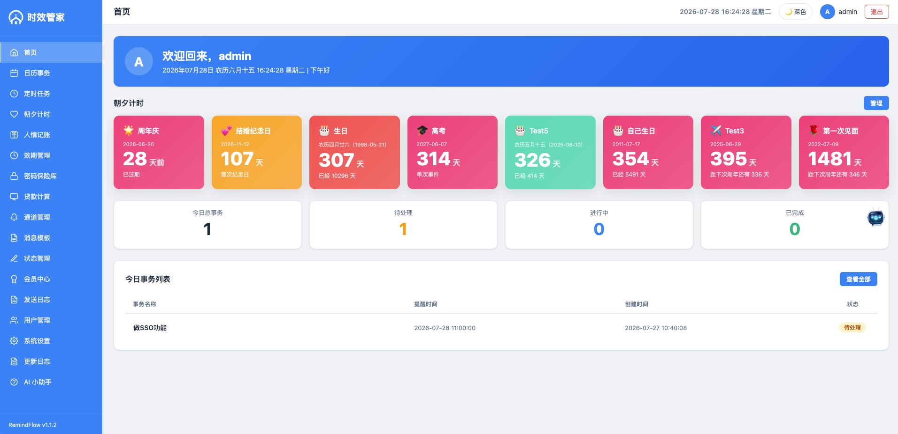

### 2. 日历事务

以日历为核心的日程管理模块：

- 左侧日历支持农历显示、待办标记、月份切换与「今天」快速定位。
- 右侧按选中日期展示当日事务列表，包含事务名称、提醒时间、创建时间、状态。
- 支持新增、查看、编辑、删除事务，以及 Excel 导入批量创建。
- 顶部可按「事务 / 日 / 周 / 月 / 季 / 年」切换视图粒度。

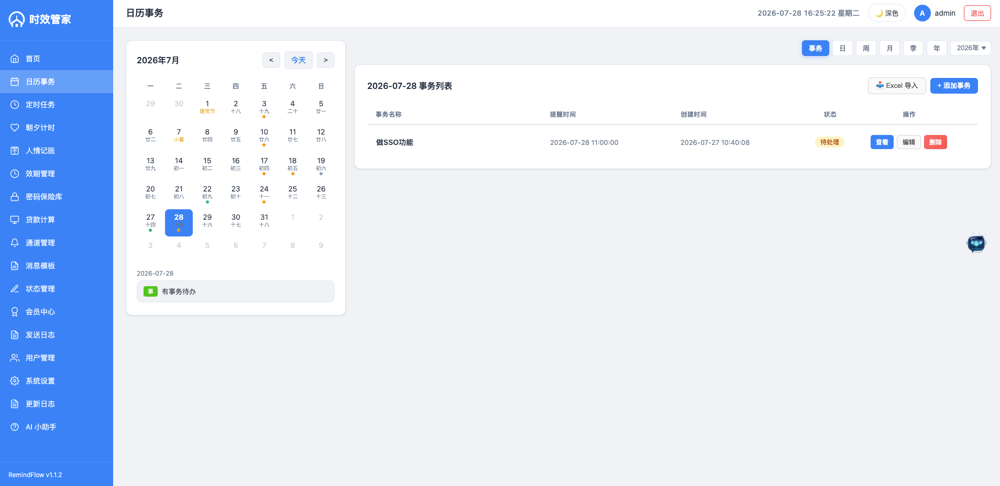

### 3. 定时任务

用于管理周期性自动提醒任务：

- 任务列表展示任务名称、定时规则、有效期、运行状态。
- 支持灵活的 Cron 风格规则，例如「每月 1 号 10:00」「每 2 个月 2 号 09:30」「每周四 09:30（工作日模式）」「每天 17:22（工作日模式）」。
- 每个任务可单独「查看 / 暂停 / 编辑 / 删除」。
- 顶部统计全部任务、运行中、已暂停数量。

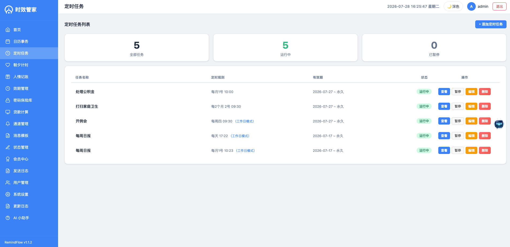

### 4. 朝夕计时

纪念日与倒计时管理中心：

- 支持正计时（已过去多少天）与倒计时（还剩多少天）。
- 可按年重复、单次事件、农历日期等多种方式设置。
- 每个纪念日可配置「首页显示」「通知开关」，并提供隐藏 / 编辑 / 删除操作。
- 顶部统计全部纪念日、首页显示数、已开启通知数。

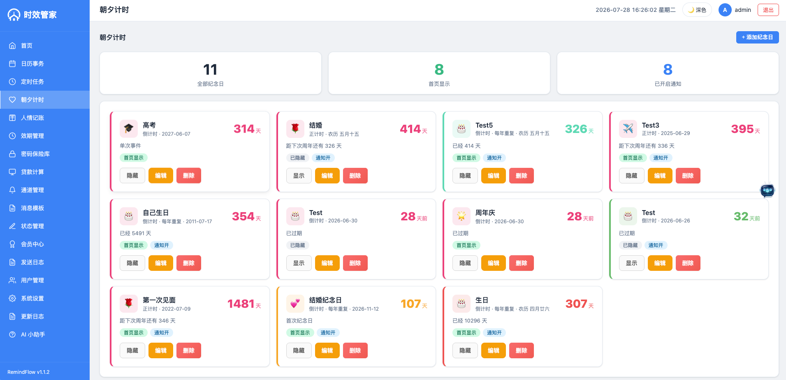

### 5. 人情记账

记录人际交往中的礼金、礼品与回礼情况：

- 顶部汇总卡片：本年送出礼金、本年收到礼金、收支净额、待回礼单据数。
- 列表展示往来对象、关系、事件类型、日期、方向（送出 / 收到）、礼金、礼品、回礼状态、预计回礼时间。
- 支持新增记录、Excel 导入、往来对象管理、配置、统计图表。
- 筛选条件包含方向、事件类型、日期范围、关键词搜索、仅看未回礼。
- 支持编辑、复制、标记已回礼、删除。

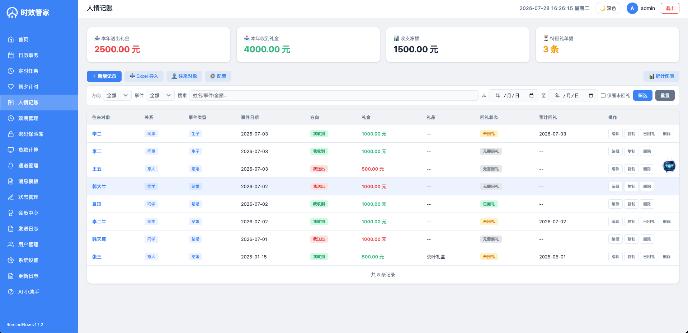

### 6. 效期管理

家庭物品保质期与有效期追踪：

- 顶部统计全部物品、已过期、≤7 天、≤30 天、正常数量。
- 支持新增物品、扫码录入（自动识别商品条形码）、批量导入、分类管理。
- 列表展示物品名称、分类、条码、生产日期、保质期、到期日、剩余天数（进度条可视化）、存放位置。
- 提供详情、编辑、删除操作，临期 / 过期物品一目了然。
- 移动端适配优化，筛选区与操作按钮紧凑排布。

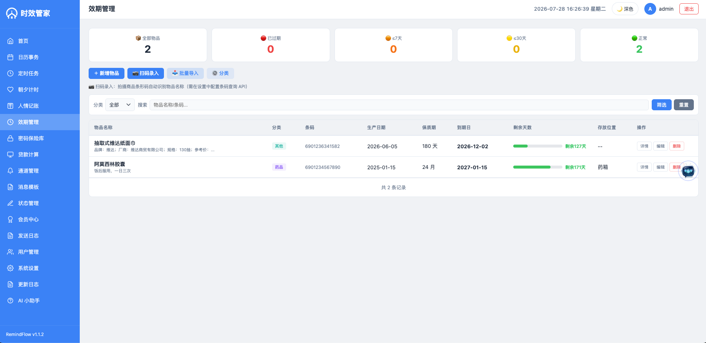

### 7. 密码保险库

安全的账号密码集中管理：

- 支持分组管理（如个人密码、工作密码）。
- 列表展示标题、用户名、网址，支持查看、编辑、删除。
- 提供锁定功能，防止他人偷看。
- 支持按标题或用户名搜索。

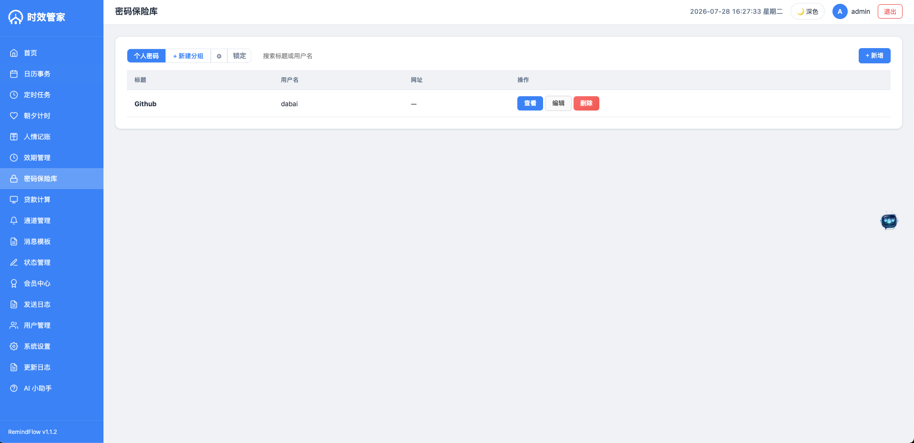

### 8. 贷款计算

房贷 / 消费贷还款计划与提前试算：

- 列表页展示贷款笔数、总贷款本金、总剩余本金，以及每笔贷款的月供、利率、还款进度、剩余利息。
- 详情页提供还款明细表，包含期数、还款日、月供、本金、利息、剩余本金、利率、状态（已还 / 未还）。
- 支持利率变更、提前还款、试算、改还款日、批量还款、共享管理等高级操作。
- 帮助用户清晰掌握每一期还款构成与总利息支出。

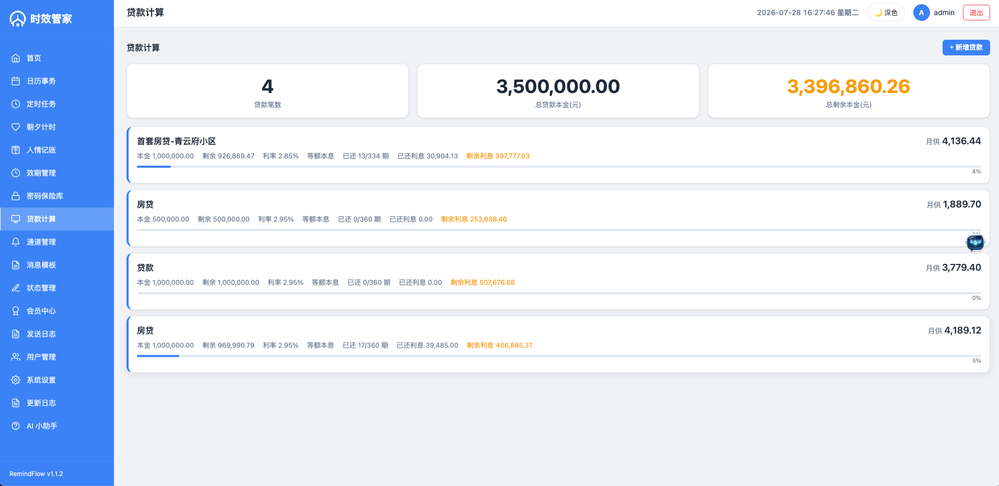
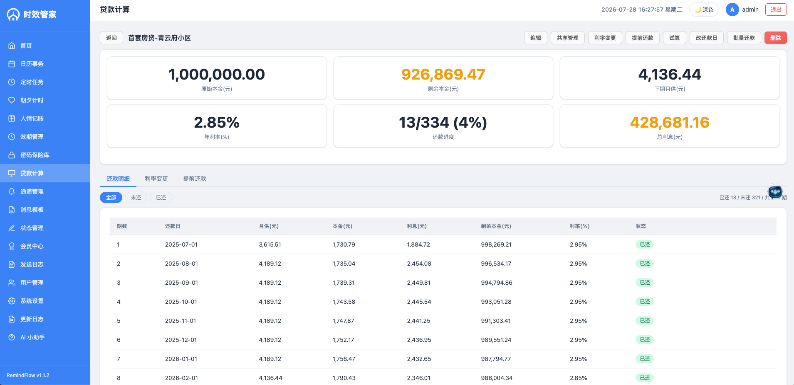

### 9. 通道管理

统一管理所有消息推送通道：

- 支持 Server 酱、企业微信机器人、WxPusher、163 邮件通知、魔法推送等多种通道。
- 每个通道可配置推送类型（Text / HTML）、启用状态，并提供测试按钮。
- 通道可随时启用 / 禁用，方便调试与切换。

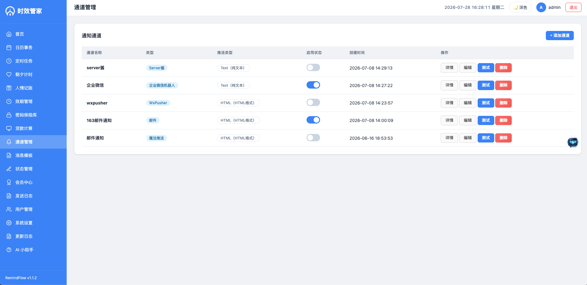

### 10. 消息模板

消息内容模板化管理：

- 区分自定义模板与系统模板。
- 支持按类型筛选，可设置默认模板、启用 / 禁用。
- 模板内容类型支持 HTML，便于排版与样式控制。

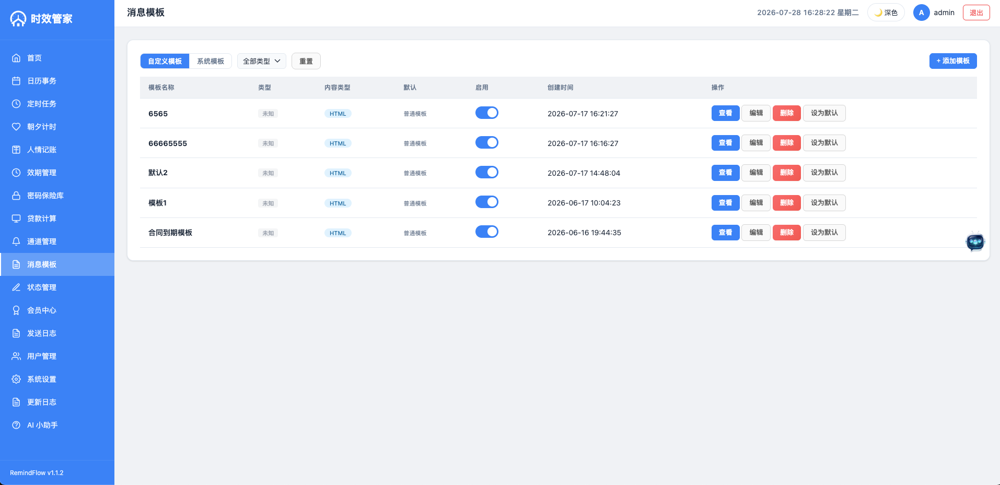

### 11. 状态管理

事务状态自定义配置：

- 内置「待处理、进行中、已完成」等系统状态。
- 支持新增自定义状态（如「已关闭」）。
- 可为每个状态设置排序与是否发送提醒。

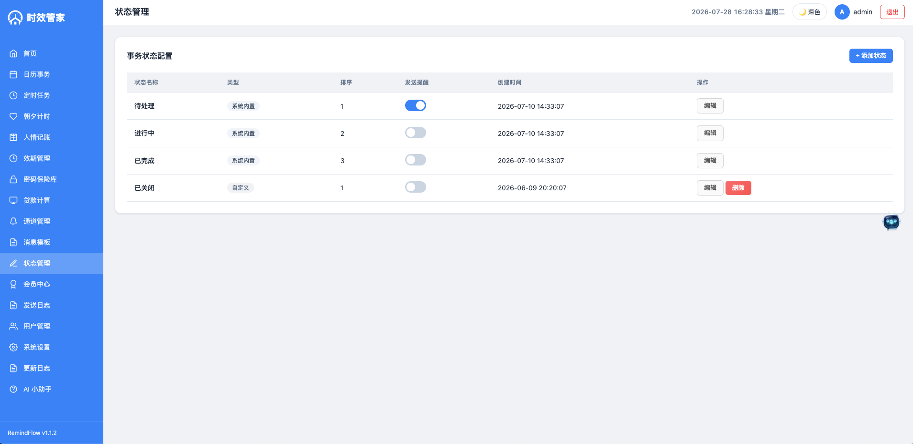

### 12. 系统设置

个性化与系统级配置入口：

- **账户设置**：个人信息修改、登录密码修改。
- **提醒通知**：事务提醒检测、人情记账通知、效期管理通知、贷款计算通知等子项开关。
- **外观与主题**：深浅主题切换、主题色选择。
- **功能开关**：可隐藏不使用的模块（如人情记账、效期管理），关闭后不再推送相关提醒。

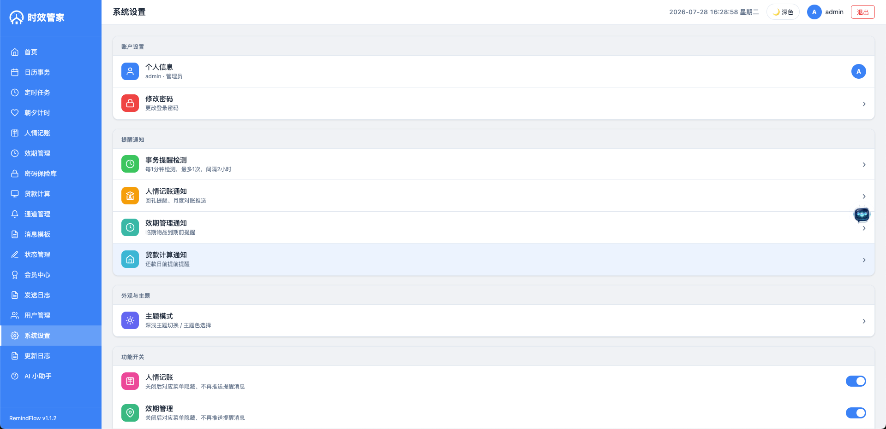

### 13. AI 小助手

基于 DeepSeek、豆包、通义千问等多家大模型的智能问答助手：

- 支持在多家模型间切换，按需选择最适合当前任务的 AI 能力。
- 支持新建对话与历史会话快速切换。
- 可针对本地数据进行自然语言查询，例如：「本月人情记账花了多少？」「我今天有什么任务？」「我设置了哪些定时任务？」。
- 返回结构化的数据摘要与贴心文案，复杂问题可继续追问。

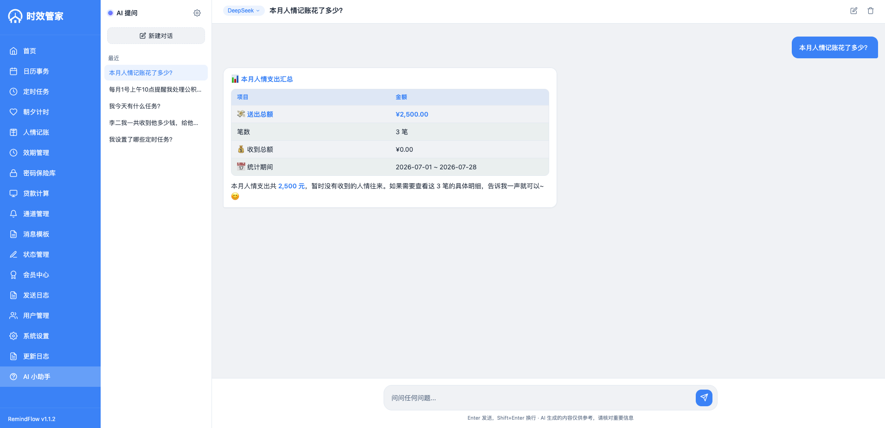

---

## 四、使用建议

1. **首次登录**后先进入「系统设置」配置主题色与提醒通知开关。
2. 在「通道管理」中至少启用一个推送通道并点击「测试」，确保提醒能正常送达。
3. 常用纪念日建议开启「首页显示」与「通知」，这样每天打开首页就能看到重要日子。
4. 效期管理建议配合「扫码录入」使用，减少手动输入条形码与名称的麻烦。
5. 贷款计算录入后可通过「提前还款」与「试算」功能评估不同还款策略的节省效果。

---

## 五、项目愿景

时效管家希望成为每个人生活里的「第二大脑」，把分散在备忘录、日历、记账 App、便签纸里的信息统一起来，通过定时提醒、到期预警与 AI 查询，让重要事项不再被遗漏。

如果你在使用过程中遇到 bug 或有新功能建议，欢迎通过公众号「大白聊技术」反馈。
